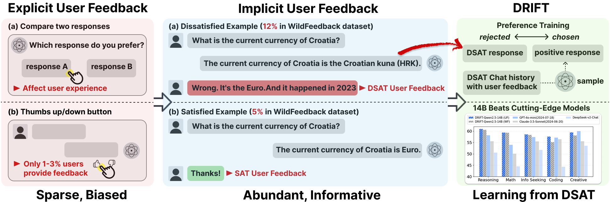

# DRIFT: Learning from Abundant User Dissatisfaction in Real-World Preference Learning
This repository contains the official code for DRIFT (Dissatisfaction-Refined Iterative preference Training), a post-training recipe that leverages abundant implicit user dissatisfaction (DSAT) signals from real-world deployments while requiring minimal explicit satisfaction (SAT) feedback. DRIFT anchors training on DSAT and dynamically samples positives from the evolving policy. On real-world WildFeedback and synthetic UltraFeedback datasets, DRIFT achieves up to +6.23% (7B) / +7.61% (14B) on WildBench Task Score and up to +8.95% (7B) / +12.29% (14B) on AlpacaEval2 win rate over base models, outperforming strong baselines such as iterative DPO and SPIN. At larger scales, 14B models trained with DRIFT surpass GPT-4o-mini on WildBench. DRIFT also preserves exploratory capacity, yielding more diverse high-reward solutions rather than collapsing to narrow subsets. Theoretically, we show that DRIFT preserves preference margins and avoids gradient degeneration, providing an effective and scalable recipe for real-world post-training that exploits the most abundant and informative signal.



## Setup

### Requirements

This project uses the [Alignment Handbook](https://github.com/huggingface/alignment-handbook) for DPO training. Follow these steps to set up the environment:

1. Clone the Alignment Handbook repository:
```bash
git clone https://github.com/huggingface/alignment-handbook.git
cd alignment-handbook
```

2. Set up the environment as described in the Alignment Handbook documentation.

3. Clone this repository:
```bash
git clone https://github.com/cacayaya/DRIFT.git
cd DRIFT
```

## Data Generation
 
We provide the user satisified/dissatisfied chat data (SAT/DSAT) we used from [WildFeedback](https://huggingface.co/datasets/microsoft/WildFeedback) in the `./data/sat_data.jsonl` and `./data/dsat_data.jsonl`.

We also curate a DSAT->SAT seed set (491 pairs) from WildFeedback, where a dissatisfied user turn (DSAT) is followed by a revised model response that satisfies the user (SAT). Each pair provides a natural preference: the DSAT response fails to meet expectations, while the subsequent SAT response is preferred. We provide this seed data in the `./data/seed-data`.

All data can also be found at Huggingface: [DRIFT Collection](https://huggingface.co/collections/AmberYifan/drift-68e5cbfbc1b3ed9bb161b6d5).

To generate drift preference data for iterative training, run:
```bash
CUDA_VISIBLE_DEVICES=0 python gen-drift.py \
    --model_name Qwen/Qwen2.5-7B-Instruct-seed \
    --input_file ./data/dsat_data.jsonl
```
This will use provided model to generate the chosen responses and paired with DSAT response from the real-world chat.

For new iteration, simply change the model for current iteration: 
```bash
CUDA_VISIBLE_DEVICES=0 python gen-drift.py \
    --model_name Qwen/Qwen2.5-7B-Instruct-DRIFT-iter1 \
    --input_file ./data/dsat_data.jsonl
```
## Training with DPO

After generating preference data, you can use the Alignment Handbook for DPO training. And you can find corresponding training configs in `./configs`

## Evaluation

For evaluation, we use WildBench and AlpacaEval2. WildBench is built from challenging ChatGPT-human user queries in WildChat-1M, making it well suited for assessing our method for real-world performance. 
- [WildBench](https://github.com/allenai/WildBench)
- [AlpacaEval2](https://github.com/tatsu-lab/alpaca_eval)


## References

- [Alignment Handbook](https://github.com/huggingface/alignment-handbook)
- [WildBench](https://github.com/allenai/WildBench)
- [AlpacaEval2](https://github.com/tatsu-lab/alpaca_eval)


